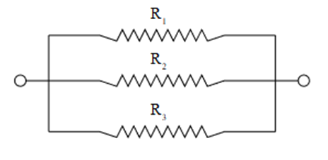

# Ejercicio 2 $(5 \space puntos)$ #
Implementa una función, `resistencia.m` que recibe como argumento el valor de tres resistencias en paralelo $R_1$, $R_2$ y $R_3$, implementar el algoritmo en base a la siguiente ecuación.

$$
\displaystyle
\begin{equation}
   R_{eq} = \frac{1}{\frac{1}{R_1} + \frac{1}{R_2} + \frac{1}{R_3}}
\end{equation}
$$

Retornar el valor de $R$, es decir, $R_{eq}$.

